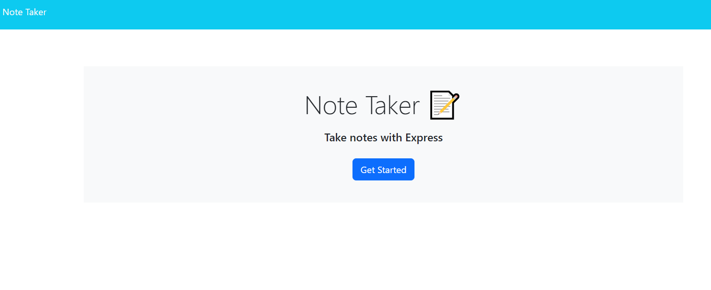
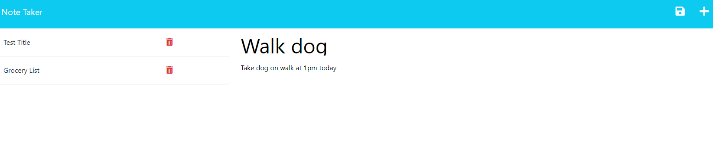

# Express.js Note-Taking-App

## Description
A note taking application that can be used to write and save notes. It uses Express.js for back-end functionality.

## Table of Contents 
- [Description](#description)
- [Installation](#installation)
- [Usage](#usage)
- [License](#license)

## Installation
 - Clone the repo
 - Install packages with `npm i` in an integrated terminal

## Usage
 - At home, users are presented with Get Started button. They can then enter a new note by clicking the "+" symbol. Note titles and texts will show on the left and can be viewed.
 - Notes can then be deleted from side panel.

Deployed Heroku link: https://aqueous-castle-53044-41c6df6c3ada.herokuapp.com/
(working on deployment fixes as routes are incorrect)

## License
  
